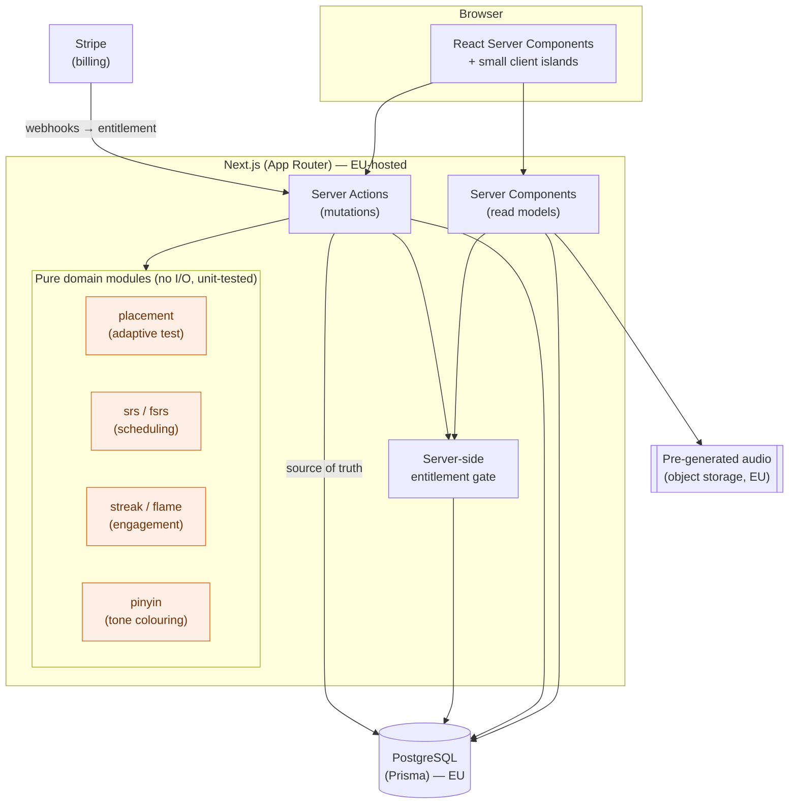
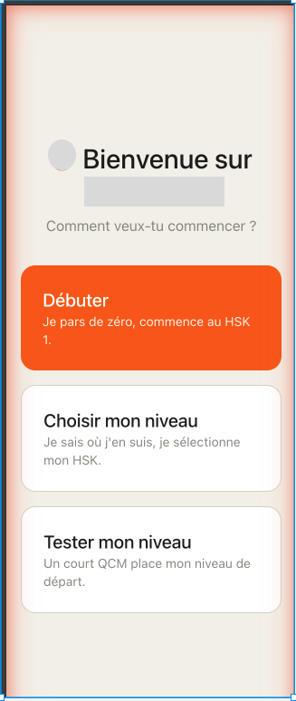
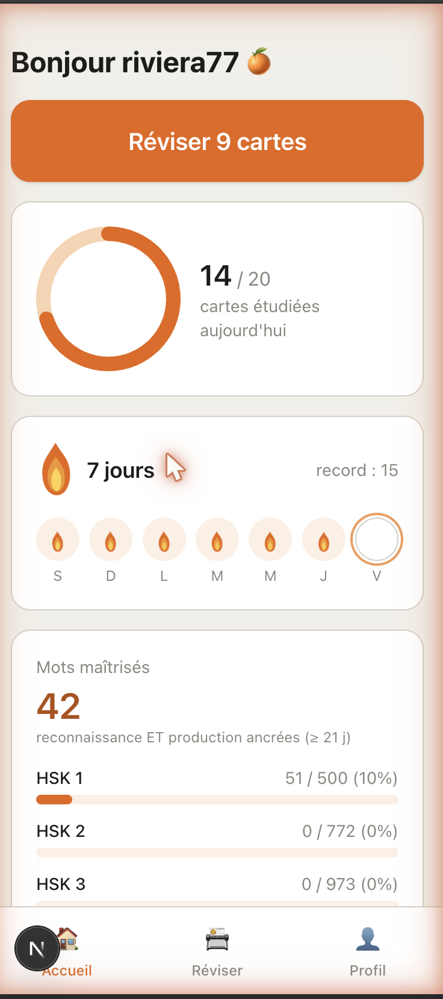

# Case study — a server-first Mandarin learning app

How I designed and built a polished, production-grade Mandarin (HSK) learning web app as a solo developer: the problem, the architecture, the engineering trade-offs, and the testing approach. The three packages in this repository were extracted from it.

> **What this is — and isn't.** This is a public engineering write-up. It describes *how* the app is built and *why* I made the calls I made. It contains no secrets, no pricing, no access-control thresholds, and no proprietary data. Where a decision touched money or entitlements, I describe the principle, not the values.

## The problem

Learners of Mandarin who speak French are underserved: most quality apps teach through English, and tones — the part beginners struggle with most — are rarely made visible. I set out to build a focused app around the reformed **HSK 3.0** standard with a single, well-polished core loop: get placed at the right level, then review vocabulary daily with spaced repetition, with the characters, pinyin, a native-quality audio, and an example sentence on every card — tones shown in colour.

The constraints shaped everything:

- **Solo developer.** Every part has to be maintainable by one person. That biases toward proven libraries over bespoke engines, and toward a small number of well-tested pure modules over sprawling stateful code.
- **EU-based, selling to consumers.** Data residency and privacy are first-class requirements, not an afterthought — which ruled out the default US-centric hosting stack.
- **Quality perceived from screen one.** An MVP here is *one core loop executed at a high finish*, not a broad set of half-built features.

## The stack

A server-first **Next.js (App Router)** application in **TypeScript**, using **React Server Components** for data-backed screens and **server actions** for mutations, styled with **Tailwind**. Spaced repetition is scheduled by **`ts-fsrs`** (a proven FSRS implementation). Data lives in **PostgreSQL** through **Prisma**. Authentication is **self-hosted (Better Auth)** so user records live in my own database; subscriptions run on **Stripe**, with the entitlement state treated as authoritative in Postgres. Everything is deployed on **EU-hosted infrastructure** for a GDPR-aligned, sovereign stack.

## Architecture

Two ideas carry the design.

**A pure domain core.** The parts of the app that encode real logic — the adaptive placement algorithm, the spaced-repetition scheduling, the streak/flame rules, the pinyin tone colouring — are written as *pure modules*: no database access, no framework, no side effects. They take data in and return data out. That is what makes them fast to unit-test in isolation, and it is precisely why three of them could be lifted out of the app and published here as standalone packages with their tests intact. The stateful shell (server components, server actions, Prisma) orchestrates these modules but contains very little logic of its own.

**Entitlement is a server boundary.** Whether a given piece of content is unlocked is decided on the server, reading an entitlement state in Postgres that Stripe webhooks keep authoritative. The client is never trusted to make that call, and the concrete boundary values are not encoded anywhere a reader of this repository could see them. (See [ADR 0004](./adr/0004-server-enforced-entitlement.md).)

## Testing philosophy

The value of a learning app *is* its correctness — a wrong tone colour or a mis-scheduled card erodes trust immediately. So the domain logic is designed to be tested cheaply and exhaustively.

Because the domain modules are pure, their tests need no database, no browser, and no mocking. The private application carries **62 passing tests** across these modules; the three packages extracted into this repository ship **71 tests of their own** (26 + 28 + 17), all runnable with a single `npm test`. The tests target *invariants* rather than magic numbers — for example, the placement engine is asserted to attribute an answer to the tier that was asked (not the one it moves toward), to clamp at the range bounds, and to converge — so they survive future tuning of the thresholds. Porting the placement tests into the public package even surfaced a latent bug in the original (an "unknown level" lookup returned `0` instead of a clear sentinel), which the public version fixes.

This is the through-line of the whole project: keep the logic pure, test the invariants, and the stateful shell stays thin and boring — which is exactly what you want from code one person has to maintain.

## The extracted packages

Each is a self-contained, MIT-licensed building block with its own README, tests, and a live demo:

| Package | What it demonstrates |
|---------|----------------------|
| [`pinyin-tone-colors`](../packages/pinyin-tone-colors) | Unicode-correct string handling, a zero-dependency core with an optional framework layer, defensive fallbacks. |
| [`adaptive-placement`](../packages/adaptive-placement) | Pure, immutable, domain-agnostic algorithm design, thoroughly unit-tested. |
| [`streak-flame`](../packages/streak-flame) | Accessible motion design — pure-CSS animation that honours `prefers-reduced-motion`. |

## Architecture decision records

The reasoning behind the load-bearing choices, written as narrative (principles, not production values):

- [ADR 0001 — An EU-sovereign, self-hosted-auth stack](./adr/0001-eu-sovereign-stack.md)
- [ADR 0002 — Adopt a proven spaced-repetition library instead of rolling my own](./adr/0002-adopt-fsrs.md)
- [ADR 0003 — Pre-generate audio in batch rather than calling live TTS](./adr/0003-batch-precomputed-audio.md)
- [ADR 0004 — Enforce entitlement on the server](./adr/0004-server-enforced-entitlement.md)

## Screens

  
  &nbsp;&nbsp;
  

<b>Left:</b> onboarding — three ways in (start from scratch, choose a level, or take the adaptive placement test). <b>Right:</b> the dashboard — daily-goal ring, the streak flame with its seven-day band, and mastered-words progress by level.

The colour-coded review card and the streak flame are also fully explorable, live, through the package demos: [`pinyin-tone-colors` demo](../packages/pinyin-tone-colors/demo/index.html) and [`streak-flame` demo](../packages/streak-flame/demo/index.html).

---

_Written by Codingqueen40. The application itself is private; this repository shares the reusable pieces and the engineering story behind them._
