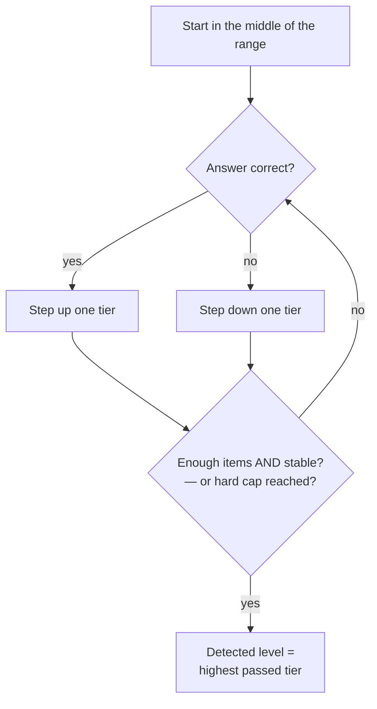

# adaptive-placement

> A tiny, dependency-free **staircase** adaptive placement-test engine. Pure, immutable, domain-agnostic logic — bring your own questions and level labels.

<p align="center">
  <a href="https://www.npmjs.com/package/adaptive-placement"></a>
  
  
  
  
</p>

Place a learner (or any test-taker) at the right level in a handful of questions. The engine climbs a "staircase": ask harder after a correct answer, easier after a wrong one, stop once it stabilises around the competence boundary, then infer the level. It knows nothing about your domain — you map its tier numbers to whatever labels you use.

## The idea



## Install

```bash
npm install adaptive-placement
```

## Quick start

The engine works in **tier numbers** (`1..N`). Drive it from your UI: present an item at `state.currentTier`, then feed the result back.

```ts
import {
  createInitialState,
  nextLevel,
  isFinished,
  computeDetectedLevel,
} from "adaptive-placement";

let state = createInitialState(1, 7); // tiers 1..7, starts at the middle

while (!isFinished(state)) {
  const item = pickQuestionAtTier(state.currentTier); // your code
  const correct = await ask(item);                    // your UI
  state = nextLevel(state, correct);
}

const tier = computeDetectedLevel(state.answers); // → e.g. 4
```

### Map tiers to your own levels

```ts
import { createLevelScale } from "adaptive-placement";

const cefr = createLevelScale(["A1", "A2", "B1", "B2", "C1", "C2"]);
cefr.levelToTier("B1"); // 3
cefr.tierToLevel(3);    // "B1"

// Merge several real levels into one tier — just give that tier one label:
const grades = createLevelScale([1, 2, 3, 4, 5, 6, "7+"]);
grades.tierToLevel(7); // "7+"
```

### Try it without a UI

`simulatePlacement` runs a full session against an oracle — perfect for tests, tuning, or a demo.

```ts
import { simulatePlacement, computeDetectedLevel } from "adaptive-placement";

// A taker who reliably answers tiers ≤ 4 and misses the rest:
const state = simulatePlacement((tier) => tier <= 4, { minTier: 1, maxTier: 7 });
computeDetectedLevel(state.answers); // → 4
```

## Configuration

Every stopping and scoring knob is tunable; pass a partial config where you need it (defaults shown).

| Option | Default | Meaning |
|--------|---------|---------|
| `maxItems` | `12` | Hard stop — never present more than this. |
| `minItems` | `8` | Never stop earlier, even if already stable. |
| `passThreshold` | `0.7` | Success rate needed to "pass" a tier. |
| `minItemsPerTier` | `2` | Items required at a tier before its rate counts. |
| `stableWindow` | `4` | Trailing window used to detect stabilisation. |

```ts
import { computeDetectedLevel, isFinished, DEFAULT_PLACEMENT_CONFIG } from "adaptive-placement";

const config = { ...DEFAULT_PLACEMENT_CONFIG, passThreshold: 0.8, maxItems: 15 };
isFinished(state, config);
computeDetectedLevel(state.answers, config);
```

## Design notes

- **Pure & immutable.** No I/O, no framework, no persistence. Every transition returns a fresh `PlacementState`, so it's trivial to unit-test and safe to keep in React/server state.
- **Answers attribute to the tier that was asked**, not the one you move toward — a small invariant the whole flow relies on.
- **Two stop conditions.** A hard item cap guarantees termination; a stabilisation check (single tier, or two adjacent tiers, over the trailing window) ends early once the staircase has converged.
- **Graceful scoring.** The detected level is the highest tier passed with a large enough sample; if nothing passes, it floors to the lowest tier seen rather than throwing.

## API

```ts
type PlacementAnswer = { tier: number; wasCorrect: boolean };
type PlacementState  = { minTier: number; maxTier: number; currentTier: number; answers: PlacementAnswer[] };
type PlacementConfig = { maxItems; minItems; passThreshold; minItemsPerTier; stableWindow };
type LevelScale<T>   = { count; levels; tierToLevel(tier): T | null; levelToTier(level: T): number };

createInitialState(minTier: number, maxTier: number): PlacementState;
nextLevel(state: PlacementState, wasCorrect: boolean): PlacementState;
isFinished(state: PlacementState, config?: PlacementConfig): boolean;
computeDetectedLevel(answers: PlacementAnswer[], config?: PlacementConfig): number; // tier number
simulatePlacement(answer: (tier: number) => boolean, opts: { minTier; maxTier; config? }): PlacementState;
createLevelScale<T>(levels: readonly T[]): LevelScale<T>;
DEFAULT_PLACEMENT_CONFIG: PlacementConfig;
```

## Demo

Open [`demo/index.html`](./demo/index.html) — set a simulated taker's true level and reliability, then watch the staircase converge and read off the detected level. No build step.

## Development

```bash
npm install
npm test          # vitest — 28 pure unit tests
npm run build     # tsup → ESM + CJS + .d.ts
npm run typecheck
```

## License

[MIT](./LICENSE) © Codingqueen40
