# pinyin-tone-colors

> Colour Mandarin **hanzi** and **pinyin** by tone. A tiny, zero-dependency, framework-agnostic core with an optional React component.

<p align="center">
  
</p>

<p align="center">
  <a href="https://www.npmjs.com/package/pinyin-tone-colors"></a>
  
  
  
</p>

Colour is one of the fastest ways to internalise Mandarin tones. This package turns a word plus its numbered pinyin into ready-to-render, tone-coloured segments — **without ever showing the tone numbers**. It does one thing, has no runtime dependencies, and leaves rendering entirely up to you.

## Why it exists

Most tone-colouring code is tangled into a component, a CSS framework, or a dictionary. This is the opposite: a **pure function** that returns plain data (`{ text, tone }[]`). Paint it with React, Vue, a template string, or canvas — your call. It was extracted from a production Mandarin-learning app and is documented as a case study in [`chinese.io`](../../README.md).

## Install

```bash
npm install pinyin-tone-colors
```

## Quick start

The tone is read from **numbered pinyin** (`"ni3 hao3"`) used as the source of truth; you display the hanzi or the diacritic pinyin, and the numbers stay hidden.

```ts
import { toneSegments } from "pinyin-tone-colors";

toneSegments("你好", "ni3 hao3");
// → [ { text: "你", tone: 3 }, { text: "好", tone: 3 } ]

toneSegments("nǐhǎo", "ni3 hao3", "pinyin");
// → [ { text: "nǐ", tone: 3 }, { text: "hǎo", tone: 3 } ]
```

### React

React is an optional peer dependency, imported from a separate entry so the core stays dependency-free. The component is presentational and side-effect free — safe inside a **React Server Component**.

```tsx
import { Pinyin } from "pinyin-tone-colors/react";

<Pinyin text="你好" numbered="ni3 hao3" />;              // coloured characters
<Pinyin text="nǐhǎo" numbered="ni3 hao3" mode="pinyin" />; // coloured pinyin

// Colour via your own CSS classes instead of inline styles (Tailwind, CSS vars…):
<Pinyin text="你好" numbered="ni3 hao3" toneClassName={(t) => `tone-${t}`} />;
```

### No framework? Render to an HTML string

```ts
import { toHtml } from "pinyin-tone-colors";

toHtml("你好", "ni3 hao3");
// → '<span style="color:#639922">你</span><span style="color:#639922">好</span>'
```

## Tone palette

The default palette is tuned to stay distinguishable for common colour-vision deficiencies. Every colour is overridable — pass your own `TonePalette` to any helper or to `<Pinyin>`.

| Tone | Name | Default |
|------|------|---------|
| 1 | high & flat |  `#E24B4A` |
| 2 | rising |  `#BA7517` |
| 3 | dipping |  `#639922` |
| 4 | falling |  `#378ADD` |
| 5 | neutral |  `#888780` |
| 0 | *no tone* | inherits `currentColor` |

```ts
import { toneSegments, toHtml, type TonePalette } from "pinyin-tone-colors";

const myPalette: TonePalette = { 1: "#d33", 2: "#b80", 3: "#3a3", 4: "#37d", 5: "#999" };
toHtml("你好", "ni3 hao3", "hanzi", myPalette);
```

## How it works (and why it's safe)

- **Numbered pinyin is the source of truth.** `"ni3 hao3"` is parsed into `{ toneless, tone }` syllables; the displayed text never contains the digit.
- **1:1 alignment or nothing.** `colorHanzi` colours a character per syllable only when their counts match; otherwise it returns a single uncoloured segment. It never mangles or truncates the input.
- **Unicode-correct.** Characters are walked by code point (astral characters and surrogate pairs are safe), and diacritic pinyin is normalised to **NFC** before slicing so each accented vowel is one unit.
- **Separators are dropped.** Apostrophes, hyphens and spaces in the pinyin (`xī'ān`, `hǎo-de`) are removed from the coloured output.

## API

```ts
type Tone = 0 | 1 | 2 | 3 | 4 | 5;           // 0 = inherit, 5 = neutral
type ToneColoredSegment = { text: string; tone: Tone };
type Mode = "hanzi" | "pinyin";
type TonePalette = Record<1 | 2 | 3 | 4 | 5, string>;

parseNumberedPinyin(numbered: string): { toneless: string; tone: Tone }[];
colorHanzi(hanzi: string, numbered: string | null): ToneColoredSegment[];
colorPinyin(pinyin: string, numbered: string | null): ToneColoredSegment[];
toneSegments(text: string, numbered: string | null, mode?: Mode): ToneColoredSegment[];
segmentsToHtml(segments: ToneColoredSegment[], palette?: TonePalette): string;
toHtml(text: string, numbered: string | null, mode?: Mode, palette?: TonePalette): string;
toneColor(tone: Tone, palette?: TonePalette): string | undefined;

DEFAULT_TONE_COLORS: TonePalette;
```

`pinyin-tone-colors/react` additionally exports the `Pinyin` component and `PinyinProps`.

## Demo

Open [`demo/index.html`](./demo/index.html) in a browser — a live playground: type any word plus its numbered pinyin and watch it colour, edit the palette, and toggle hanzi/pinyin mode. No build step.

## Development

```bash
npm install
npm test          # vitest — pure core + a React static-render test
npm run build     # tsup → ESM + CJS + .d.ts
npm run typecheck
```

## License

[MIT](./LICENSE) © Codingqueen40
