# streak-flame

> An animated SVG streak flame for React that grows with the streak. Pure-CSS animation, tiered intensity, and `prefers-reduced-motion` aware.

<p align="center">
  
</p>

<p align="center">
  <a href="https://www.npmjs.com/package/streak-flame"></a>
  
  
  
  
</p>

Reward a habit with a flame that gets bigger the longer the streak runs: a gentle **lit** flame in the first week, a **strong** one after a week, a sparking **blaze** after a month. The animation is 100% CSS (safe in a React Server Component), and it respects users who ask for reduced motion.

## Install

```bash
npm install streak-flame
```

```ts
import { Flame } from "streak-flame";
import "streak-flame/styles.css"; // once, anywhere in your app
```

## Usage

Pass the streak; the tier is derived for you.

```tsx
<Flame streak={5} />                 {/* lit   */}
<Flame streak={12} />                {/* strong */}
<Flame streak={40} title="40-day streak" /> {/* blaze, accessible */}
```

A broken streak renders nothing:

```tsx
<Flame streak={0} /> // → null
```

Stagger a row so the flames don't flicker in lockstep:

```tsx
{days.map((d, i) => (
  <Flame key={d.id} streak={d.streak} size={28} delayMs={i * 120} />
))}
```

## Tiers

| Tier | Default streak | Look |
|------|----------------|------|
| `none` | ≤ 0 | renders nothing |
| `lit` | 1–6 | smaller, calm flicker |
| `strong` | 7–29 | full size |
| `blaze` | 30+ | larger, brighter core, rising sparks |

Thresholds are configurable:

```tsx
<Flame streak={4} thresholds={{ strong: 3, blaze: 10 }} /> // → strong
```

Or compute the tier yourself with the pure helper:

```ts
import { flameTier } from "streak-flame";
flameTier(9);                              // "strong"
flameTier(9, { strong: 3, blaze: 10 });    // "blaze"
```

## Theming

Colours and tier scales are CSS custom properties — override them on `.sf-wrap` or any ancestor:

```css
.sf-wrap {
  --sf-outer: #d6452a;
  --sf-mid: #ef7d3a;
  --sf-core: #ffd15c;
  --sf-core-blaze: #fff0b0;
  --sf-spark: #ffd15c;
  --sf-scale-lit: 0.82;
  --sf-scale-strong: 1;
  --sf-scale-blaze: 1.12;
}
```

## Accessibility

- **Reduced motion.** Under `prefers-reduced-motion: reduce`, every animation is switched off — the flame stays visible but still, and the sparks (which only read as motion) are hidden. Meaning is never conveyed by motion alone.
- **Decorative by default.** With no `title`, the SVG is `aria-hidden`. Pass `title` (e.g. `"40-day streak"`) to expose it as a labelled image with a `<title>`.

## Props

| Prop | Type | Default | |
|------|------|---------|--|
| `streak` | `number` | — | Streak length; the tier is derived from it. |
| `tier` | `"none" \| "lit" \| "strong" \| "blaze"` | — | Force a tier, ignoring `streak`. |
| `thresholds` | `{ strong: number; blaze: number }` | `{ strong: 7, blaze: 30 }` | Tier boundaries. |
| `size` | `number` | `44` | Width in px (height keeps the 100:140 ratio). |
| `delayMs` | `number` | `0` | Offsets the flicker (stagger a row). |
| `title` | `string` | — | Accessible label; also switches the SVG to `role="img"`. |
| `className` | `string` | — | Extra class on the wrapper. |

## Demo

Open [`demo/index.html`](./demo/index.html) — drag the streak slider and watch the flame cross each tier; a toggle previews the reduced-motion behaviour. No build step.

## Development

```bash
npm install
npm test          # vitest — pure tier logic + React static-render tests
npm run build     # tsup → ESM + CJS + .d.ts
npm run typecheck
```

## License

[MIT](./LICENSE) © Codingqueen40
